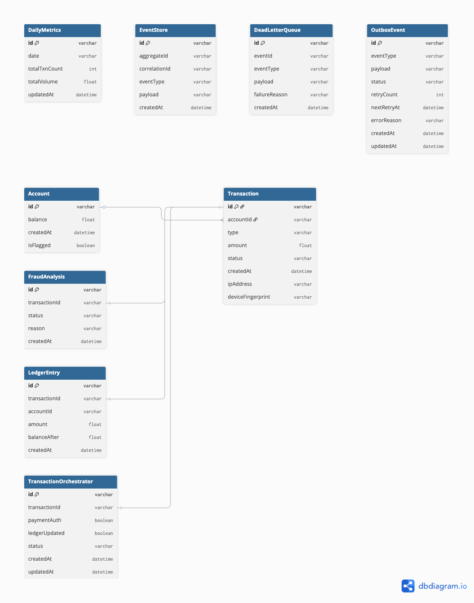

# Event-Driven Banking Orchestrator

A production-grade, highly resilient backend banking application utilizing Event Sourcing, Saga Orchestration, Dead Letter Queue workflows, and Distributed Event Brokerage through Apache Kafka.

## Database Schema (ER Diagram)
Below is the structural relationship between our underlying domain models. 

*The schema leverages strict 1-to-1 relations between the master transaction sequence and sub-domain processors (Fraud, Orchestrator, Ledger).*
